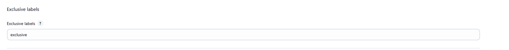
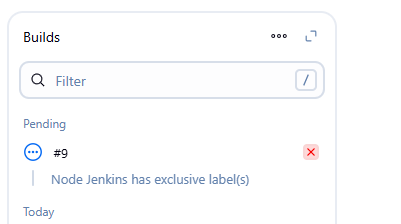

# Exclusive Labels Plugin

[](https://ci.jenkins.io/job/Plugins/job/exclusive-labels-plugin/job/main/)
[](https://plugins.jenkins.io/exclusive-label-plugin)
[](https://github.com/jenkinsci/exclusive-labels-plugin/releases/latest)
[](https://plugins.jenkins.io/exclusive-label-plugin)

Plugin enables to define exclusive agent labels

## Usage

Exclusive label enables specify which lablels are exclusive in Jenkins global configuration.



"Exclusive label" means that node with this label can be assigned only if user wants this label.

Example: an agent has three labels linux, hibernate, ipv6 and ipv6 is exclusive label. The agent cannot be asigned by label expression linux, hibernate, linux&&hibernate and so on because this labels do not match ipv6. The agent can be assigned by expression which match ipv6 too, for example: linux && ipv6.



## Configuration as code

```yaml
unclassified:
  exclusiveLabels:
    labelsInString: 'exclusive1 exclusive2'
```

## LICENSE

Licensed under MIT, see [LICENSE](LICENSE.md)
